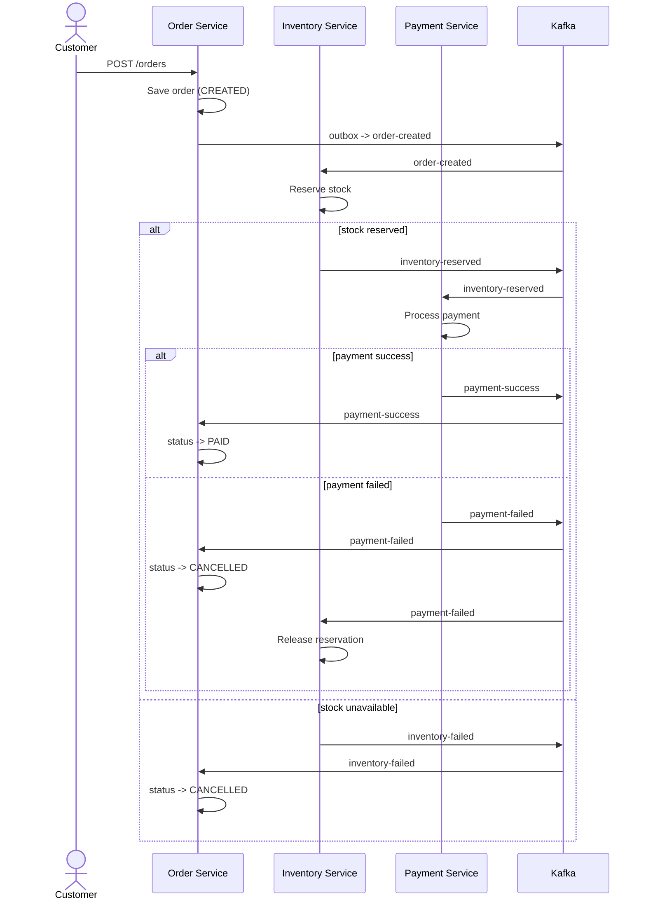
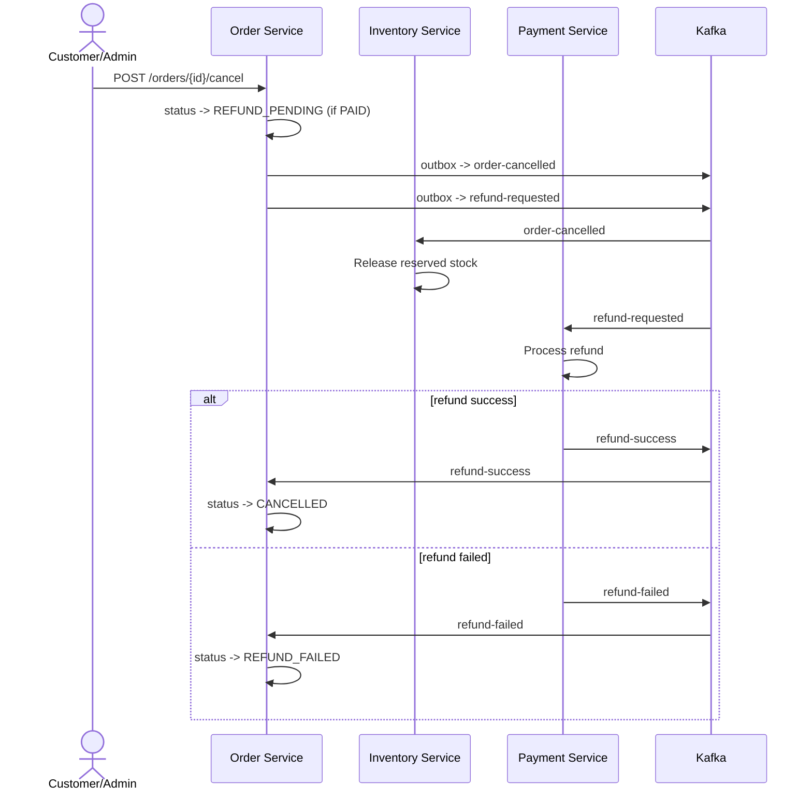

# E-Commerce Order Management System - Architecture (Latest)

## 1. System Overview

This is a multi-service Spring Boot system with two React frontends.

Core services:
- `user-service`
- `product-service`
- `inventory-service`
- `order-service`
- `payment-service`
- `common-lib` (shared security and exception handling)

Infra:
- PostgreSQL (database-per-service)
- Kafka (event backbone)
- Nginx (gateway/reverse proxy)
- Prometheus + Grafana (metrics collection and visualization)
- OpenTelemetry + Jaeger (distributed tracing)
- Docker Compose (local orchestration)

Frontends:
- `frontend/customer-web`
- `frontend/admin-panel`

---

## 2. High-Level Runtime Flow

### Checkout Saga
1. Customer creates order via `POST /orders`.
2. Order service persists order + outbox event `order-created`.
3. Inventory consumes `order-created`, reserves stock.
4. Inventory publishes either:
   - `inventory-reserved`, or
   - `inventory-failed`
5. Payment consumes `inventory-reserved`, processes payment, publishes:
   - `payment-success`, or
   - `payment-failed`
6. Order consumes payment/inventory outcomes and updates order state.
7. Inventory consumes compensation topics to release stock where needed.

### Cancellation + Refund Saga
1. `POST /orders/{id}/cancel`:
   - if order not paid: status -> `CANCELLED`, publish `order-cancelled`
   - if order paid: status -> `REFUND_PENDING`, publish `order-cancelled` + `refund-requested`
2. Payment consumes `refund-requested`, processes refund, publishes:
   - `refund-success`, or
   - `refund-failed`
3. Order consumes refund result:
   - `refund-success` -> `CANCELLED`
   - `refund-failed` -> `REFUND_FAILED`

### Checkout Saga Sequence

### Paid Cancellation + Refund Sequence

---

## 3. Order and Payment States

### Order status values used by current code
- `CREATED`
- `PLACED`
- `PAYMENT_PENDING`
- `PAID`
- `REFUND_PENDING`
- `REFUND_FAILED`
- `CANCELLED`
- `DELIVERED`

### Payment status values
- `PENDING`
- `COMPLETED`
- `FAILED`
- `REFUNDED`

---

## 4. Event Topics and Contracts

### Produced topics
- Order service outbox:
  - `order-created`
  - `order-cancelled`
  - `refund-requested`
- Inventory service outbox:
  - `inventory-reserved`
  - `inventory-failed`
- Payment service outbox:
  - `payment-success`
  - `payment-failed`
  - `refund-success`
  - `refund-failed`

Contract metadata:
- Outbox publishers include header `event-contract-version` (`v1`).
- Schemas are versioned under `docs/contracts/v1`.

### Consumer subscriptions
- Inventory consumer:
  - `order-created`
  - compensation topics: `payment-failed`, `inventory-failed`, `order-cancelled`
- Payment consumer:
  - `inventory-reserved`
  - `refund-requested`
- Order consumer:
  - `payment-success`, `payment-failed`, `inventory-failed`
  - `refund-success`, `refund-failed`

---

## 5. Reliability Strategy

Current strategy is **at-least-once delivery + idempotent handling**, not hard exactly-once.

Implemented protections:
- Transactional outbox tables in producer services.
- Scheduled outbox publishers with status transitions:
  - `PENDING` -> `IN_PROGRESS` -> `PUBLISHED`/`FAILED`
- Consumer dedup via `processed_events(event_key UNIQUE)`.
- Duplicate-key collisions treated as already-processed in dedup service.
- Kafka `DefaultErrorHandler` configured with non-retryable exceptions for unrecoverable failures.

---

## 6. Security and Access Model

Roles:
- `ROLE_CUSTOMER`
- `ROLE_ADMIN`

Highlights:
- Stateless JWT auth via shared filter from `common-lib`.
- Role/route enforcement in shared `SecurityConfig`.
- Public reads for products/categories (`GET`).
- Admin-only write operations for products/categories/inventory/payment-initiate.
- `/inventory/batch` requires authentication but is not admin-only.

---

## 7. Frontend Integration

### customer-web
- Browse products and categories.
- Multi-image product display.
- Cart quantity controls and stock-aware behavior.
- Checkout and order history views.

### admin-panel
- Manage products and categories.
- Order list with customer enrichment (`/users/batch` backend call).
- Order filtering (status/date/customer) and row-click navigation behavior.

All frontend traffic is routed through gateway `/api/*` in standard local setup.
